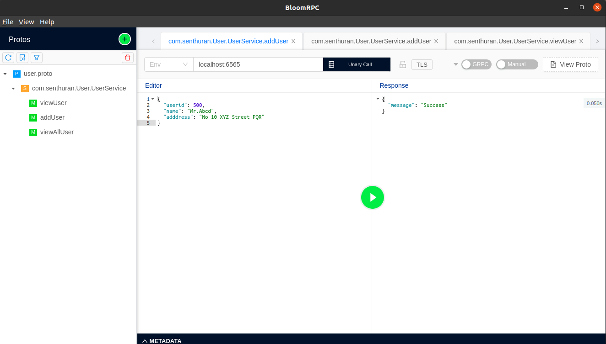
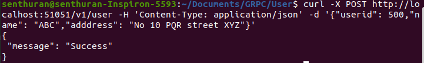

# grpc-User
gRPC based API service implementation  using Spring boot and Couchbase Server.

* Install the couchbase server. Please refer this [link](https://docs.couchbase.com/server/5.1/install/getting-started-docker.html)
  
  ```$ docker run --restart=always -d --name couchbase  -v ~/couchbase:/opt/couchbase/var -p 8091-8094:8091-8094 -p 11210:11210 couchbase:community-6.0.0```

* Create a bucket and configure index for the bucket.
* Add new user for the bucket and give the full access.
* Then configure the [application.properties](https://github.com/Senthuran100/grpc-User/blob/master/src/main/resources/application.properties)
* Then use a gRPC client(for ex:- [BloomRPC](https://github.com/uw-labs/bloomrpc)) to call the rpc methods. Below I've attached the bloomRPC screenshot for adding users.

  
### Exposing gPRC service as HTTP JSON...


* Annotate the gRPC service with the HTTP Options. Please refer this [proto](src/main/proto/user.proto) file.
* Generate the .pd file from the proto file. Please refer the below command to generate the .pb file.<br/>
``` protoc -I. -Ibuild/extracted-include-protos/main --include_imports --include_source_info --descriptor_set_out=user.pb src/main/proto/*.proto ```
* Configure the envoy to proxy the HTTP request to the GRPC service.    
  -> For this create a config file and make the configuration. Please refer this [envoy-config.yml](config/envoy-config.yml) file.
* Run the envoy using docker. Some time you need to pull the docker image for envoyproxy/envoy. Then run the below command to run the docker image. <br/>
```sudo docker run -it --rm --name envoy --network="host" -v "$(pwd)/user.pb:/data/user.pb:ro" -v "$(pwd)/config/envoy-config.yml:/etc/envoy/envoy.yaml:ro" envoyproxy/envoy:v1.16.2```
  
* After running the envoy proxy we will be able to access the gRPC service directly through http calls. We don't need to use an external gRPC client like bloomRPC to access the service. Please refer the curl command to access the service.<br/>

-> get All users<br/>
``curl http://localhost:51051/v1/user``<br/>

-> get user by id<br/>
```curl http://localhost:51051/v1/user/500```<br/>

-> Add user with request body. <br/>
``curl -X POST http://localhost:51051/v1/user -H 'Content-Type: application/json' -d '{"userid": 500,"name": "ABC","adddress": "No 10 PQR street XYZ"}'``

Please refer the below image.<br/> 


